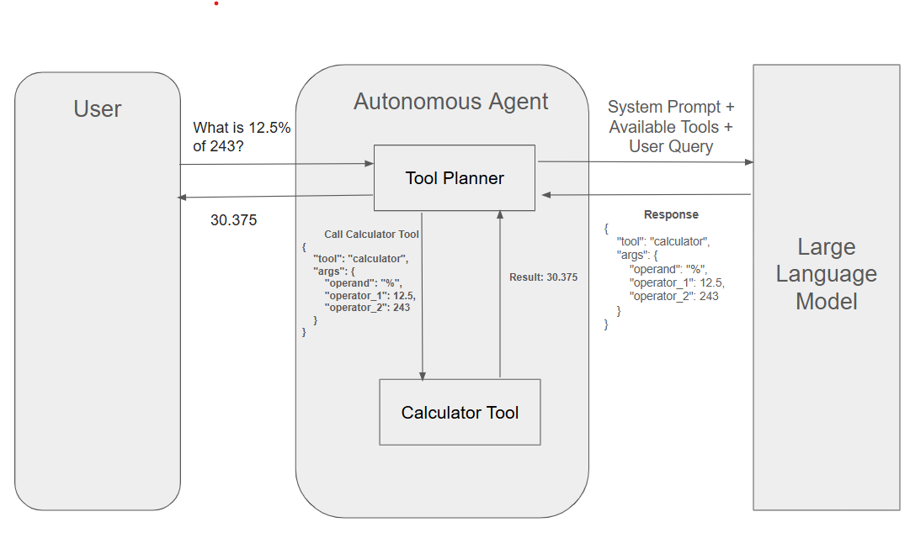
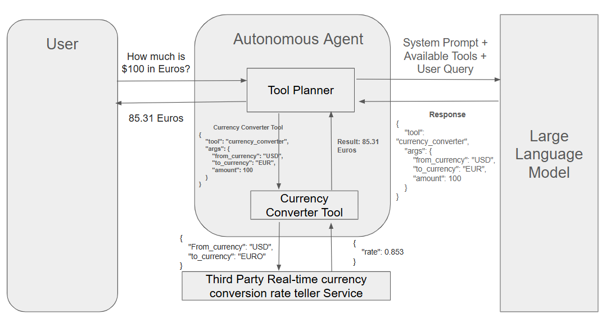
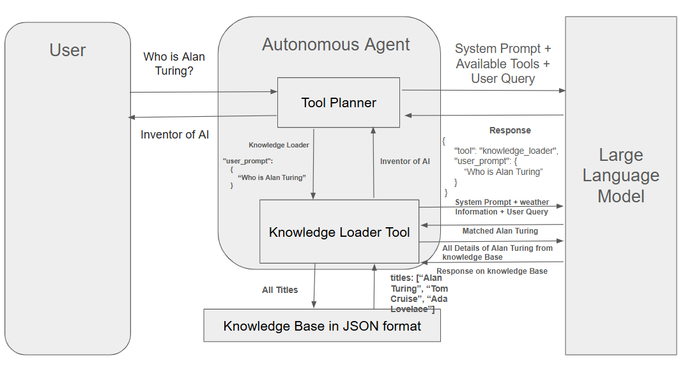
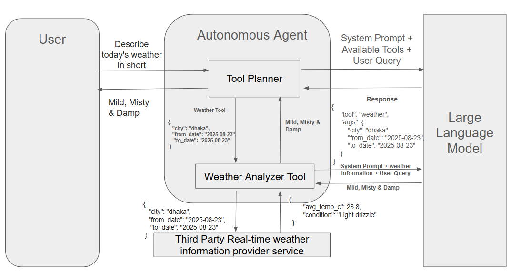

# Autonomous Agent: Documentation

## Introduction
An **AI-powered autonomous agent** designed to handle user queries using any configured **Large Language Model (LLM)**.  
To effectively respond to diverse user requests, the LLM can leverage various **specialized tools**.  
By intelligently selecting the appropriate tool, the agent ensures **efficient, accurate, and autonomous query handling**.

---

## Project Overview
**Goal**: To build an AI agent that can use various tools depending to user request and generate helpful and valuable results to the user.

**Problem Statement**: Powerfull LLMs like ChatGPT, Gemini, Claude, Grok, and so on can understand user quries in natural languages very well. But, usually they don't have access of various of tools to support user queries. For example, current weather report, sports result, complex calculator or some tools that are not well known, popular or customized by the user. So, supporting user query using the tools by LLMs is not possible. This project gives a platform to the programmers to build different tools and ask LLMs to use those tools to generate helpful results.

**Limitations & Scopes**: 

1. Limited set of tools are available to use. However, new tools are easily extendable
2. A simulation of LLM has been used instead of genuin LLM. But a real LLM can be easily configured
3. Only JSON files can be used as data source

---

##  Requirements
**Functional Requirements**:

1. A efficient tool planner to choose tools to support quries
2. Currency Converter tools is newly added with the tool group
3. A user friendly response to user or assist with user prompt if required

**Non-functional Requirements**:

1. Effecient error handling capabilities
2. Scalable to add new tools in the AI agent
3. Scalable to use different LLMs with the AI agent
---

##  High-level Architecture & System Design


### 1. User
- The starting point of the process.
- A user provides a **query** to the system.

### 2. Autonomous Agent
The core of the system that manages the interaction between the user, tools, and the LLM.

It consists of two key modules:
- **Tool Planner**
  - Receives the user query.
  - Decides whether the query should be forwarded to the LLM or handled with available tools.
  - Selects the most **appropriate tool** based on the query and available capabilities.
- **Tools**
  - Executes specific tasks such as calculations, weather fetching, knowledge retrieval, etc.
  - May interact with **third-party services** to fetch or process data.
  - Returns results to the **Tool Planner** for further processing.

### 3. Large Language Model (LLM)
- Enhances the query-handling capabilities of the system.
- The Tool Planner sends the **query with available tool details** to the LLM.
- The LLM identifies and suggests the **appropriate tool** or customizes the query for better processing.
- Provides a **response** after utilizing tools or interpreting results.

### 4. Third-Party Services
- External systems or APIs that provide real-world data or services (e.g., weather API, finance API).
- The **Tools** module interacts with these services to fulfill the user’s query.


### Workflow Summary
1. The **User** submits a query.  
2. The **Tool Planner** receives the query.  
3. The query may be forwarded to the **LLM** with information about available tools.  
4. The LLM suggests an **appropriate tool** or customizes the query.  
5. The **Tools** module executes the task, possibly using **Third-Party Services**.  
6. The **response** is sent back through the **Tool Planner** and ultimately returned to the **User**.

### Key Idea
This architecture combines the reasoning power of a **Large Language Model** with specialized **tools** and **external services** to create an **efficient, autonomous system** capable of handling diverse user queries.

---

##  Tooling & Infrastructure

### **Calculator Tool**

### 1. User
- The user initiates the process by asking a query:
  ```
  What is 12.5% of 243?
  ```
- Receives the final answer from the system:
  ```
  30.375
  ```

### 2. Autonomous Agent
The **Autonomous Agent** orchestrates the process of solving the query.  
It contains the following module:

- **Tool Planner**
  - Receives the user’s query.
  - Sends the query along with the **system prompt** and **available tools** to the LLM.
  - Receives the LLM’s suggestion in the form of a structured response indicating which tool to use and with what arguments.
  - For this example, the LLM responds with:
    ```json
    {
      "tool": "calculator",
      "args": {
        "operand": "%",
        "operator_1": 12.5,
        "operator_2": 243
      }
    }
    ```
  - Calls the **Calculator Tool** with these arguments.
  - Collects the result from the tool (30.375) and passes it back to the user.

- **Calculator Tool**
  - Executes the mathematical operation based on the arguments received.
  - In this case: `12.5% of 243 = 30.375`.

### 3. Large Language Model (LLM)
- Receives the **system prompt + available tools + user query** from the Tool Planner.
- Decides which tool should be used.
- Returns a structured response specifying the correct tool and its arguments.

### Workflow Summary
1. The **User** asks: *“What is 12.5% of 243?”*  
2. The **Tool Planner** sends the query to the **LLM** with system context.  
3. The **LLM** suggests using the **Calculator Tool** with specific arguments.  
4. The **Tool Planner** invokes the **Calculator Tool** with the provided arguments.  
5. The **Calculator Tool** computes the result `30.375`.  
6. The **Tool Planner** returns the result to the **User**.  

### Key Idea
This diagram shows how an **Autonomous Agent** uses the reasoning capabilities of a **Large Language Model** combined with a **specialized tool** (Calculator) to solve a query in a structured and reliable way.

### **Currency Converter Tool**


### 1. User Input
- The user asks: **"How much is $100 in Euros?"**

### 2. Tool Planner (Autonomous Agent)
- The **Tool Planner** inside the Autonomous Agent receives the query.
- It identifies that a **Currency Converter Tool** is required.
- It formulates a request:
  ```json
  {
    "tool": "currency_converter",
    "args": {
      "from_currency": "USD",
      "to_currency": "EUR",
      "amount": 100
    }
  }
  ```

### 3. Currency Converter Tool
- The **Currency Converter Tool** forwards the request to a **Third-Party Real-time currency conversion service** with:
  ```json
  {
    "from_currency": "USD",
    "to_currency": "EURO"
  }
  ```

### 4. Third-Party Service Response
- The service replies with the current conversion rate, e.g.:
  ```json
  {
    "rate": 0.853
  }
  ```

### 5. Conversion Calculation
- The **Currency Converter Tool** calculates:
  \\( 100 \times 0.853 = 85.31 \\)
- Result: **85.31 Euros**

### 6. Response to User
- The **Tool Planner** sends the result back to the user:
  **"85.31 Euros"**

---

### Interaction with Large Language Model (LLM)
- The **LLM** provides reasoning for tool selection.
- It receives the **System Prompt + Available Tools + User Query**.
- It returns the required tool and arguments to the Tool Planner.

---

### Summary
This system demonstrates:
1. How an **Autonomous Agent** uses external tools.
2. How a **Large Language Model (LLM)** decides which tool to use.
3. How **Third-Party APIs** provide real-time data (currency rates).
4. How the final processed result is returned to the **User**.

### **Knowledgeg Loader Tool**


### 1. User Input
- The user asks: **"Who is Alan Turing?"**

### 2. Tool Planner (Autonomous Agent)
- The **Tool Planner** inside the Autonomous Agent receives the query.
- It identifies that the **Knowledge Loader Tool** should be used to search in the knowledge base.
- It creates a request:
  ```json
  {
    "tool": "knowledge_loader",
    "user_prompt": {
      "Who is Alan Turing"
    }
  }
  ```

### 3. Knowledge Loader Tool
- The **Knowledge Loader Tool** queries the **Knowledge Base in JSON format** for relevant entries.
- Example structure of the knowledge base:
  ```json
  {
    "titles": ["Alan Turing", "Tom Cruise", "Ada Lovelace"]
  }
  ```

### 4. Knowledge Base Response
- The knowledge base returns all relevant entries.
- The Knowledge Loader Tool filters and matches **Alan Turing**.

### 5. Knowledge Retrieval
- The Knowledge Loader Tool retrieves all available details about **Alan Turing**.
- Example result: **"Inventor of AI"**

### 6. Large Language Model (LLM) Role
- The **LLM** receives:
  - **System Prompt + Available Tools + User Query**
  - The retrieved **knowledge entry**
- It generates the final response in natural language.

### 7. Response to User
- The final answer is sent back to the **User**:
  **"Inventor of AI"**

---

## Summary
This system demonstrates:
1. How an **Autonomous Agent** fetches knowledge from structured sources.
2. How the **Tool Planner** selects the **Knowledge Loader Tool**.
3. How the **Knowledge Loader Tool** interacts with a **Knowledge Base in JSON format**.
4. How the **LLM** converts structured knowledge into a concise, user-friendly answer.


### **Weather Tool**


### 1. User Input
- The user asks: **"Describe today’s weather in short"**

### 2. Tool Planner (Autonomous Agent)
- The **Tool Planner** receives the query.
- It determines that the **Weather Analyzer Tool** is needed.
- It formulates a request for weather data:
  ```json
  {
    "city": "dhaka",
    "from_date": "2025-08-23",
    "to_date": "2025-08-23"
  }
  ```

### 3. Weather Analyzer Tool
- The **Weather Analyzer Tool** requests real-time data from a **Third-Party Weather Information Provider Service**.

### 4. Third-Party Service Response
- The service provides the raw weather data, e.g.:
  ```json
  {
    "avg_temp_c": 28.8,
    "condition": "Light drizzle"
  }
  ```

### 5. Weather Analysis
- The **Weather Analyzer Tool** interprets the data and summarizes it into a short description.
- Example result: **"Mild, Misty & Damp"**

### 6. Large Language Model (LLM) Role
- The **LLM** is given:
  - **System Prompt + Available Tools + User Query**
  - Along with **weather data**
- It generates a human-friendly summary: **"Mild, Misty & Damp"**

### 7. Response to User
- The final summarized weather description is sent back to the **User**.

---

### Summary
This system demonstrates:
1. How an **Autonomous Agent** can analyze and summarize real-time weather data.
2. How the **Tool Planner** identifies the right tool (Weather Analyzer).
3. How **Third-Party APIs** provide accurate weather data (temperature, conditions).
4. How the **LLM** converts structured data into a natural, human-friendly weather summary.
---


## Testing & Validation

The system has undergone rigorous **testing and validation** to ensure stability, reliability, and accuracy. Below are the key aspects:

### Unit Testing
- Around **40 unit test cases** were written to cover different **edge cases**.
- Each test verifies how the **AI agent system** behaves under different scenarios and ensures expected output.

### Error Handling
- **Intensive error handling** is implemented throughout the project.
- Since **LLM-generated output** can sometimes be inaccurate or misleading, safeguards are in place so the **system does not break** due to incorrect responses.

### Input & Output Validation
- Both **user inputs** and **LLM outputs** are carefully validated.
- This ensures that no invalid data leads to unexpected crashes or unstable system behavior.

---

## Future Scopes  
*(If I had more time, these are the things I would improve or add)*

### 1. Integration with Real LLMs
- Currently, a **simulation/fake LLM** is used for building the project.  
- In the future, real LLMs like **ChatGPT, Claude, etc.** could be integrated to evaluate which one works best for the autonomous agent.

### 2. Enhanced Calculator Tool
- At present, the **calculator tool** only supports basic operations:
  - Addition, Subtraction, Multiplication, Division, Percentage  
- It could be extended to handle **complex trigonometric functions** like `sin`, `cos`, `tan`, etc., making it more powerful.

### 3. Flexible Knowledge Base
- The **knowledge base** currently accepts only **JSON files**.  
- Future improvements could include:
  - Supporting multiple file formats  
  - Using **RAG (Retrieval-Augmented Generation)**  
  - Fetching knowledge directly from the **internet** using an **MCP server**  
- This would ensure more **accurate and cost-efficient** responses.

### 4. Simplified Tool Design
- The internal design of each tool can be made **simpler** and **easier to modify**, allowing faster iteration and scalability.

### 5. Extensible Architecture
- Currently, adding a new tool requires modification in **`planner.py`**.  
- A better design approach would follow the **Open-Closed Principle**:  
  - **Open for extension** (easily add new tools)  
  - **Closed for modification** (no need to change existing code).
 
### 5. Effective Logging
- Logging should be added for debug perposes
- Helps monitor system workflow when user interacts

### 5. Load Test & Latency Test
- How much concurrent call the system can take in the current configaration should be measured
- Latency to produce response should be tracked and measured

---
